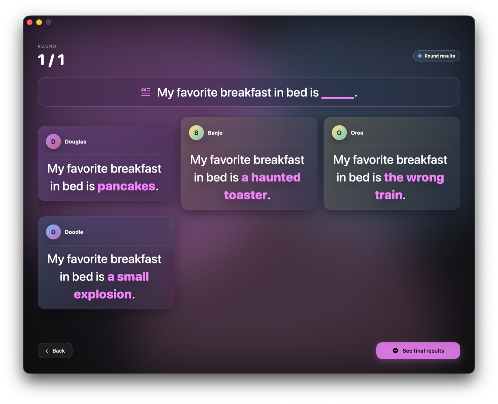

# Mot Pop

> A native macOS party word-completion game. Fill the blank, share the laugh.
> Solo against AI bots, or multiplayer over the local network with zero setup.

🇬🇧 **English** · [🇫🇷 Lire en français](#français)

<p align="center">
  <!-- Drop a 1100×840 PNG here once you have a screenshot you like. -->
  
</p>

---

## Overview

Mot Pop is a native SwiftUI macOS port of an original French web party game. Each round shows a sentence with one missing word — fill the blank, then everyone reveals their answers together. The blanks live in a shared sentence pool of around 260 prompts; the comedy comes from comparing fills.

Two modes:

- **Single-player** — play offline against 1–7 named AI bots that fill blanks from a slot-aware curated answer pool.
- **Multiplayer** — host on your local network and others on the same network discover and join automatically through Bonjour. No IP, no QR code, no signup, no internet required.

Localized in **English** and **French** — UI strings, sentence prompts, bot names, and bot answer pools all swap based on the system language.

## Features

- Native SwiftUI on macOS 14+, **single binary** (the host's game-server runs in-process via `NWListener` + `NWConnection`).
- Bonjour service publishing & discovery on `_motpop._tcp`.
- Slot-aware AI bots: a heuristic classifier reads each sentence and routes the bot's answer through the right pool (noun / adjective / verb / phrase) so the fill grammatically fits.
- Full English and French localization, including ~260 sentence prompts in each language.
- Polished UI: animated drifting glow background, glass-morphism cards, hover-lift menu cards, animated countdown ring, staggered entrance on results, and confetti on game-end.
- No third-party dependencies. No CocoaPods, no SPM.

## Requirements

- **macOS 14.0** (Sonoma) or later
- **Xcode 15** or later (to build from source)

## Build & run

```sh
open MotPop.xcodeproj
```

Press **⌘R**. The shared scheme builds immediately on a fresh clone.

Command-line build:

```sh
xcodebuild -project MotPop.xcodeproj -scheme MotPop -configuration Release
```

## How to play

1. **Pick a mode.** Single-player against bots, host a game on your local network, or join one a friend is hosting.
2. **Complete the sentence.** Each round shows a sentence with one blank, marked `§`. Type whatever fits — funny, clever, weird, anything goes.
3. **Beat the timer.** You have a few seconds to submit. Hit `Return` or click *Submit*. Submissions land within a 1.5-second grace window after the deadline.
4. **Compare and laugh.** Every player's answer slots into the same sentence. The host advances through each round, then the final recap.

Tips:

- Hosts and clients only need to be on the same local network — Bonjour discovers the game automatically.
- Short answers usually land funnier than long ones.
- Press `⌘?` from the menu to reopen the in-app How-to-play screen.

## Architecture

Single SwiftUI app, ~14 source files, no third-party dependencies.

```
MotPop/
├── MotPopApp.swift          @main scene, animated background
├── Models.swift             Player, Question, PlayerAnswer, GameConfig, SessionPhase
├── GameSession.swift        ObservableObject + SessionDriver protocol
├── SinglePlayerDriver.swift Bots, slot-aware answer scheduling
├── MultiplayerDriver.swift  HostDriver + ClientDriver
├── Networking.swift         WireMessage, length-prefixed JSON,
│                            NWListener (Bonjour) + NWBrowser
├── LocalizedContent.swift   Slot classifier + localized JSON loader
├── Components.swift         Cards, buttons, avatars, countdown ring
├── MenuView.swift           Main menu + How-to-play trigger
├── LobbyViews.swift         Solo setup, host lobby, browse, client lobby, countdown
├── GameView.swift           Question + input + ring timer
├── ResultsView.swift        Per-round grid + final recap with confetti
├── HowToPlayView.swift      Localized in-app help with credits
└── Resources/               presets-{en,fr}.json, botAnswers-{en,fr}.json,
                             botNames-{en,fr}.json
```

Three swappable drivers conform to one `SessionDriver` protocol — `SinglePlayerDriver`, `HostDriver`, `ClientDriver`. The `GameSession` observable is the only thing the views observe.

The wire protocol is `WireMessage` (a Codable enum with associated values) carried as length-prefixed JSON over `NWConnection`. Service type `_motpop._tcp`.

The slot classifier in `LocalizedContent.SlotClassifier` reads each sentence's words around `§` and routes to one of four buckets: `verb` (e.g. EN `to §`, FR `est de §`), `adjective` (e.g. `[article] § [noun]`, `is/are § and …`, FR post-nominal cues), `noun` (article precedes `§`), or `phrase` (default fallback). Tested against representative EN and FR cases.

## Credits

| Role | Person | Contact |
|---|---|---|
| Originally created by | **Amaury Crocquefer** | <amaury@crocque.fr> · [github.com/lapatatedouce59/wordGame](https://github.com/lapatatedouce59/wordGame) |
| Originally created by | **Amélie** | <amelie@pmdapp.fr> · [github.com/AisakaPMD](https://github.com/AisakaPMD) |
| macOS port | **Douglas Carmichael** | <dcarmich@dcarmichael.net> |

The original web version was a Discord-authenticated Node.js + WebSocket party game in French. This macOS port re-implements the same core mechanic natively in SwiftUI with Network.framework and Bonjour, adds an English localization, and replaces Discord OAuth with local-network discovery.

## License

License terms are pending — the original web project does not carry a license file, so terms are being worked out with the original authors. Until that is resolved, this code is shared as-is and should not be redistributed or used in derivative works without first contacting the credited authors.

---

<a id="français"></a>

🇫🇷 **Français** · [🇬🇧 Read in English](#mot-pop)

<p align="center">
  
</p>

## Présentation

Mot Pop est un portage macOS natif en SwiftUI d'un jeu d'ambiance web français. À chaque tour, une phrase apparaît avec un mot manquant — complétez-la, puis tout le monde révèle ses réponses en même temps. Les phrases viennent d'une banque d'environ 260 prompts ; tout l'humour est dans la comparaison des réponses.

Deux modes :

- **Solo** — affrontez 1 à 7 bots IA hors ligne, qui complètent les blancs depuis une banque de réponses ciblée par type grammatical.
- **Multijoueur** — hébergez une partie sur votre réseau local ; les autres joueurs sur le même réseau la découvrent et la rejoignent automatiquement via Bonjour. Pas d'IP, pas de QR code, pas d'inscription, pas besoin d'internet.

Localisé en **français** et en **anglais** — interface, prompts, noms et réponses des bots s'adaptent à la langue système.

## Fonctionnalités

- SwiftUI natif sur macOS 14+, **binaire unique** (le serveur de jeu de l'hôte tourne dans le même processus via `NWListener` + `NWConnection`).
- Publication et découverte Bonjour sur `_motpop._tcp`.
- IA consciente du type grammatical : un classificateur heuristique lit la phrase et oriente la réponse du bot vers le bon pool (nom / adjectif / verbe / phrase) pour que le mot s'insère grammaticalement.
- Localisation française et anglaise complète, incluant ~260 phrases dans chaque langue.
- Interface soignée : fond animé à dégradés, cartes en glassmorphism, survol des boutons, anneau de compte à rebours animé, apparition échelonnée des résultats, confettis en fin de partie.
- Aucune dépendance tierce. Pas de CocoaPods, pas de SPM.

## Pré-requis

- **macOS 14.0** (Sonoma) ou ultérieur
- **Xcode 15** ou ultérieur (pour compiler le projet)

## Compilation et lancement

```sh
open MotPop.xcodeproj
```

Appuyez sur **⌘R**. Le scheme partagé se compile sans configuration supplémentaire après un clone frais.

En ligne de commande :

```sh
xcodebuild -project MotPop.xcodeproj -scheme MotPop -configuration Release
```

## Comment jouer

1. **Choisissez un mode.** Solo contre des bots, hébergez sur votre réseau local, ou rejoignez la partie d'un ami.
2. **Complétez la phrase.** À chaque tour, une phrase contient un trou marqué `§`. Tapez ce que vous voulez — drôle, malin, absurde, tout est permis.
3. **Battez le chrono.** Vous avez quelques secondes pour répondre. Appuyez sur `Entrée` ou cliquez sur *Envoyer*. Les envois sont acceptés dans une fenêtre de tolérance de 1,5 seconde après l'expiration.
4. **Comparez et riez.** Toutes les réponses s'insèrent dans la même phrase. L'hôte fait défiler les tours, puis affiche le récapitulatif final.

Astuces :

- L'hôte et les joueurs doivent simplement être sur le même réseau local — Bonjour découvre la partie tout seul.
- Les réponses courtes sont souvent plus drôles que les longues.
- Appuyez sur `⌘?` depuis le menu pour rouvrir l'écran *Comment jouer*.

## Architecture

Application SwiftUI unique, environ 14 fichiers source, aucune dépendance tierce.

Trois drivers interchangeables conforment au protocole `SessionDriver` — `SinglePlayerDriver`, `HostDriver`, `ClientDriver`. L'observable `GameSession` est le seul état que les vues observent.

Le protocole de transport est `WireMessage` (un enum Codable à valeurs associées), encodé en JSON préfixé par sa longueur sur `NWConnection`. Type de service Bonjour : `_motpop._tcp`.

Le classificateur de slots dans `LocalizedContent.SlotClassifier` lit les mots autour de `§` et oriente vers l'un de quatre pools : `verb` (EN `to §`, FR `est de §`), `adjective` (`[article] § [nom]`, `is/are § and …`, indices post-nominaux français), `noun` (article devant `§`), ou `phrase` (par défaut).

## Crédits

| Rôle | Personne | Contact |
|---|---|---|
| Création originale | **Amaury Crocquefer** | <amaury@crocque.fr> · [github.com/lapatatedouce59/wordGame](https://github.com/lapatatedouce59/wordGame) |
| Création originale | **Amélie** | <amelie@pmdapp.fr> · [github.com/AisakaPMD](https://github.com/AisakaPMD) |
| Portage macOS | **Douglas Carmichael** | <dcarmich@dcarmichael.net> |

La version web originale était un jeu d'ambiance francophone en Node.js + WebSocket avec authentification Discord. Ce portage macOS réimplémente la même mécanique en SwiftUI natif avec Network.framework et Bonjour, ajoute une localisation anglaise, et remplace l'authentification Discord par une découverte sur le réseau local.

## Licence

La licence reste à définir — le projet web original ne dispose pas d'un fichier de licence, et les conditions sont en cours de discussion avec les auteurs originaux. En attendant, ce code est partagé en l'état et ne doit pas être redistribué ou utilisé dans une œuvre dérivée sans contacter au préalable les auteurs crédités.
